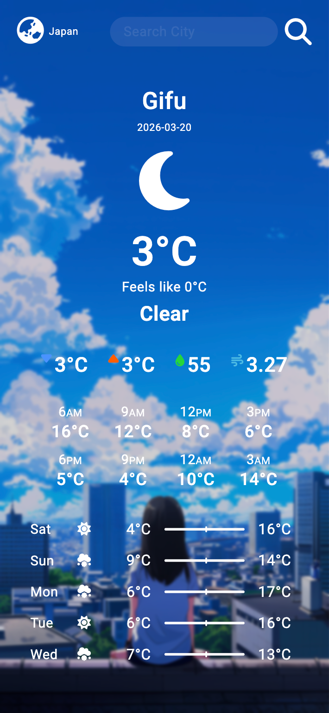
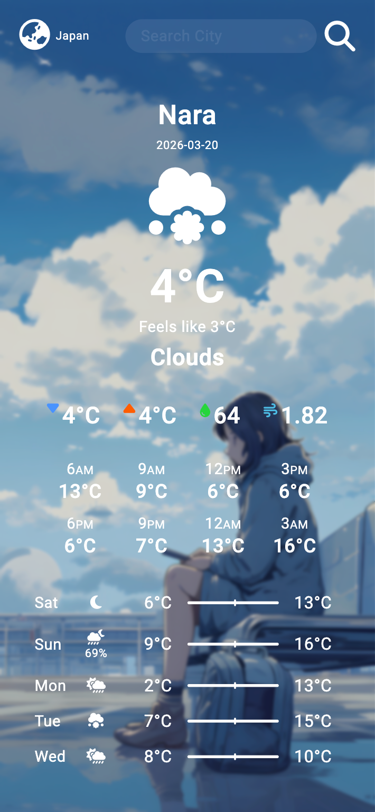
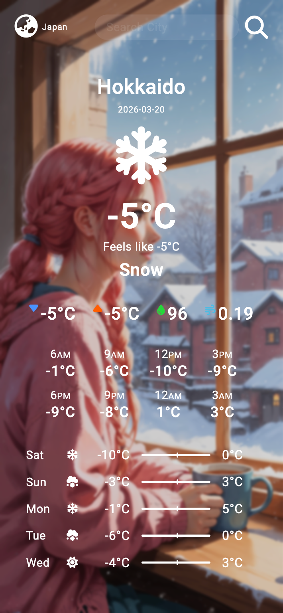

# Weather App

[日本語](#デスクリプション) / [Bahasa-Indonesia](#deskripsi) / [English](#description)

  
  
  

 

_日本語_

## デスクリプション

ユーザーが選択した都市と国に基づいて、現在の天気情報と予報を表示するモバイルファーストの天気アプリです。  
OpenWeather API と連携し、スマートフォン向けに最適化されたシンプルで見やすいインターフェースでデータを表示します。

## 機能

- 都市と国を指定して天気を検索
- ジオコーディングAPIを使用した都市候補の表示（デバウンス対応）
- 現在の天気情報（気温、湿度、風速など）の表示
- 24時間予報（3時間ごとのデータ）
- 数日間の天気予報（最高／最低気温）
- 昼夜に対応した動的アイコン表示
- 天気に応じた背景の切り替え
- localStorage による選択情報の保存
- モバイルファーストなUIデザイン

## 使用技術

- HTML5
- CSS3
- Vanilla JavaScript
- Node.js（Express）
- OpenWeather API
- Font Awesome

## 仕組み

本アプリはシンプルなクライアント・サーバー構成で動作します。

- フロントエンドが都市名や座標をもとに Express サーバーへリクエストを送信
- サーバーが環境変数に保存されたAPIキーを使用して OpenWeather API にアクセス
- 天気データ（現在・予報）をフロントエンドに返却
- フロントエンドでデータを処理し、UIに動的に反映

追加の実装内容：

- デバウンス処理によるAPIリクエストの最適化
- 日付ごとのデータグルーピングによる日別予報の生成
- 各日の代表天気として最頻値を使用

## プロジェクトの目的

本プロジェクトは以下を目的として作成しました：

- REST API の利用経験を深める
- JavaScript における非同期処理の理解
- Express を用いた簡易バックエンドの実装
- DOM操作およびUIレンダリングのスキル向上
- ポートフォリオ用のモバイルファーストアプリの作成

---

_Bahasa-Indonesia_

## Deskripsi

Aplikasi cuaca berbasis mobile-first yang menampilkan kondisi cuaca saat ini dan prakiraan berdasarkan kota dan negara yang dipilih oleh pengguna.  
Aplikasi ini menggunakan OpenWeather API dan menampilkan data melalui antarmuka yang sederhana serta dioptimalkan untuk layar smartphone.

## Fitur

- Mencari cuaca berdasarkan kota dan negara
- Menampilkan saran kota menggunakan geocoding API (dengan debounce)
- Menampilkan kondisi cuaca saat ini (suhu, kelembapan, angin, dll)
- Prakiraan 24 jam (data per 3 jam)
- Prakiraan beberapa hari dengan suhu minimum dan maksimum
- Ikon cuaca dinamis (mendukung siang/malam)
- Background berubah sesuai kondisi cuaca
- Menyimpan lokasi terakhir menggunakan localStorage
- Desain mobile-first

## Teknologi yang Digunakan

- HTML5
- CSS3
- Vanilla JavaScript
- Node.js (Express)
- OpenWeather API
- Font Awesome

## Cara Kerja

Aplikasi ini menggunakan arsitektur client-server sederhana:

- Frontend mengirim request (kota, negara, atau koordinat) ke server Express
- Server memanggil OpenWeather API menggunakan API key yang disimpan di environment variable
- Data cuaca (current & forecast) dikirim kembali ke frontend
- Frontend memproses dan menampilkan data secara dinamis ke UI

Logika tambahan:

- Debounce untuk mengoptimalkan request pencarian kota
- Pengelompokan data berdasarkan tanggal untuk membuat ringkasan harian
- Memilih kondisi cuaca yang paling sering muncul sebagai representasi harian

## Tujuan Proyek

Project ini dibuat untuk:

- Melatih penggunaan REST API
- Memahami asynchronous JavaScript
- Mempelajari dasar backend menggunakan Express
- Meningkatkan kemampuan DOM manipulation dan rendering UI
- Membuat project portfolio berbasis mobile-first

---

_English_

## Description

A mobile-first weather application that displays current weather conditions and forecasts based on user-selected city and country.  
The app integrates with the OpenWeather API and presents data through a clean interface optimized for smartphone screens.

## Features

- Search weather by city and country
- City suggestions using geocoding API (with debounce)
- Display current weather conditions (temperature, humidity, wind, etc.)
- 24-hour forecast (hourly)
- Multi-day forecast with min/max temperature
- Dynamic weather icons (day/night support)
- Background changes based on weather conditions
- Save last selected location using localStorage
- Mobile-first UI design

## Tech Stack

- HTML5
- CSS3
- Vanilla JavaScript
- Node.js (Express)
- OpenWeather API
- Font Awesome

## How it works

The application uses a simple client-server architecture:

- The frontend sends requests (city, country, or coordinates) to a custom Express server
- The server securely calls the OpenWeather API using an API key stored in environment variables
- Weather data (current and forecast) is returned to the frontend
- The frontend processes and renders the data dynamically into the UI

Additional logic includes:

- Debounced input handling for city search suggestions
- Grouping forecast data by date for daily summaries
- Selecting the most frequent weather condition for each day

## Project Purpose

This project was created to:

- Practice working with REST APIs
- Learn how to handle asynchronous data in JavaScript
- Implement a simple backend using Express
- Improve DOM manipulation and UI rendering skills
- Build a mobile-first application for portfolio use
